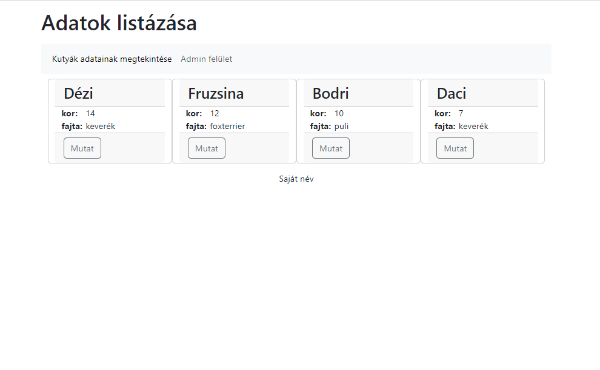
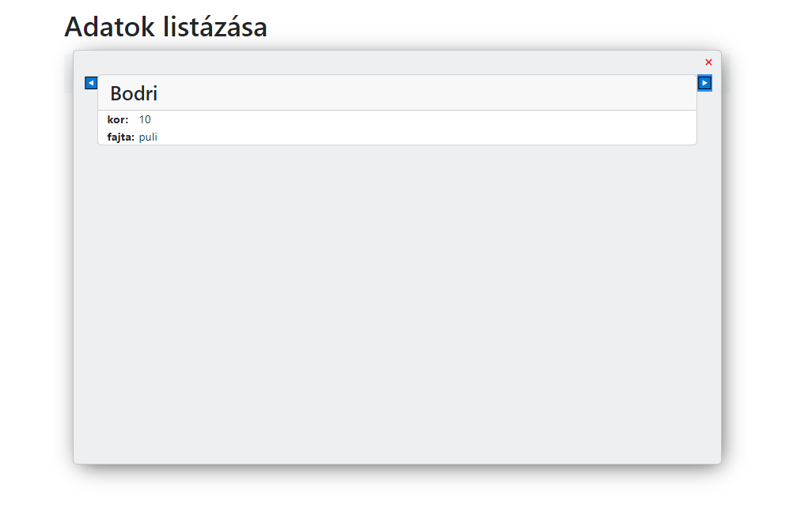
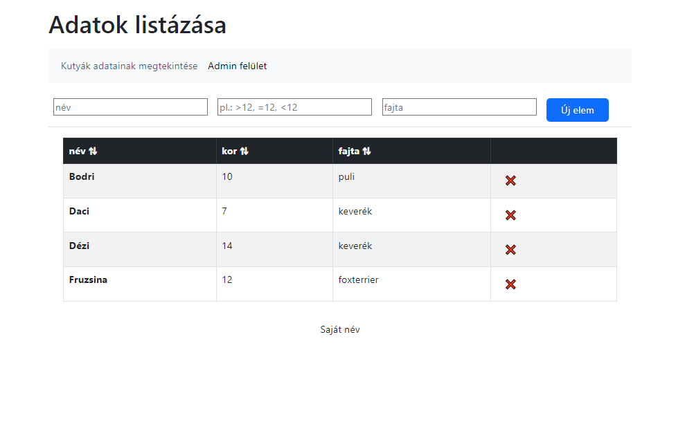
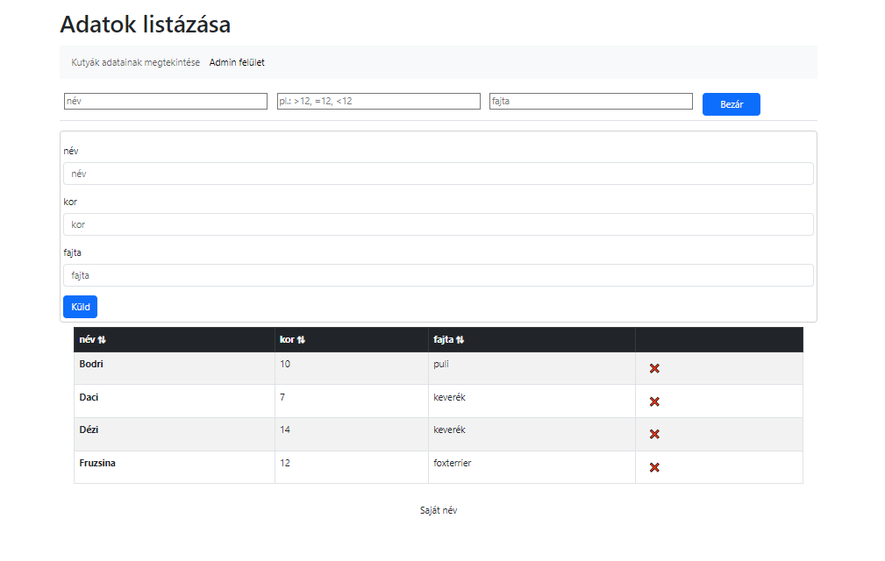
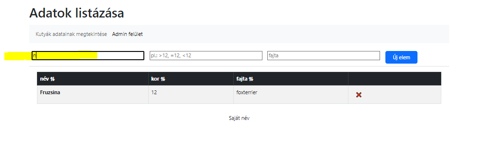

# Műveletek listákkal - Webáruház estiseknek

[GitHub Pages Link](https://zschopper.github.io/js_bootstrap5_list_crud/)

Űrlap validációra egy JS kóddal kiegésztett változat: [link](https://github.com/csefikatalin/urlapok_validalasa.git)

Kutyás feladat: alapján készíts "webáruházat" tetszőleges témában.

Lehetséges témák:

* kutyák
* receptkönyv
* autók
* gombák
* virágok
* buliesemények, eseményszervezés
* hibakezelő rendszer

Egy listában tároljuk az objektumokat, minden objektumnak legalább 3 adata legyen!  
Az adatokat jelenítsd meg egy táblázatban!  
A formázáshoz *bootstrap*-et használj, kivéve, ha már van egy gyönyörűen megformázott előző órai munkás feladatod! (Dóri, Zsolt, János, stb - nak nem kell bootsrap-re átdolgozni) A design eltérhet a képen látottól!  
A táblázat fejlécére kattintva tudjunk rendezni növekvő, illetve csökkenő sorrendbe az adatokat (Egyszer kattintunk növekvő, mégegyszer - csökkenő sorrendben az adott fejléc szerint) Az elv: a listádat rendezd, majd hívd meg újra az oldal megjelenítését!  
Hozz létre egy űrlapot - statikusan az index.html-ben. Itt kérjük be az adatokat. A bekért adatokat elhelyezzük egy objektumban, majd beletesszük a listába, és újra meghívjuk az oldal megjelenítést!  
A táblázat minden sora mellett legyen egy törlés gomb, amivel az adott sort tudjuk törölni a táblázatból.  
A táblázat minden sora mellett legyen egy szerkesztés gomb, ahol tudjuk szerkeszteni a lista adott sorát!  
A publikus felületen *div*-ekben jelenítsük meg az adatokat. Minden termékhez (*div*-hez) tartozik egy gomb, amivel meg tudjuk nézni azt az egyetlen terméket. A kiemelt termék mellett megjelenik egy bal és egy jobb léptető gomb, amivel léptetni tudjuk a terméket.  
+++ Készíthetsz Kosár funkciót is. A publikus felületen a terméket helyezheted a kosárba. A kosárban lévő termékeket listázhatod, törölheted, módosíthatod az elemszámát, majd leadhatod a rendelést! Ilyenkor készíthetsz a kosárba tett termékekről egy PDF dokumentumot is.  :D  
Lehet, hogy szükséged lesz a *localStorage* használatára.  

**Határidő:** április 15.

## ÉRTÉKELÉS

1. **Megjelenés:** bootstrappel és CSS-sel, vagy igényes CSS-sel elkészített megjelenés,
2. **RESZPONZÍV** weboldal (ha nem reszponzív, nem lehet 3-nál jobb!)
3. **Szépen szervezett kód**, funkciók szerint külön fájlokba rendezve. Ahol lehet, használjunk függvényeket paraméterezve, visszatérési értékkel!
4. let, const, változónevek helyes használata
5. **Funkcionalitás:** az ketteshez:
    1. Reszponzív kód
    2. Formázott oldal
    3. Publikus felületen az adatok div-ekben jelennek meg
    4. Az admin felületen az adatok táblázatban jelennek meg
    5. Tudok új elemet rögzíteni a listába és az megjelenik a táblázatban.
6. **Funkcionalitás:** az ötöshöz
    1. Publikus felületen az adatok div-ekben jelennek meg
    2. Az admin felületen az adatok táblázatban jelennek meg
    3. Tudom rendezni az adatokat az admin felületen
    4. Tudom törölni a táblázat adott sorát.
    5. Tudok új elemet rögzíteni a listába és az megjelenik a táblázatban.  - valid űrlap regex-szel!
    6. Tudok rendezni a táblázat fejléceire kattintva.
    7. Legalább egy mező alapján tudok szűrni.
7. **Funkcionalitás:** a hatoshoz (ezek közül egy is elég):
    1. Az admin felületen tudom módosítani a sorokat (listában)
    2. A publikus felületen ki tudok emelni egy terméket a többi termék elé
    3. A kiemelt termékeket tudom "léptetni" jobbra, balra
    4. Tudok kosárba rakni elemet
    5. Meg tudom jeleníteni a kosár tartalmát
    6. Tudom módosítani a kosár tartalmát
    7. "le tudom adni" a rendelést, PDF-et készítek, vagy egy külön oldalon összeállítom a rendelést nyomtatható formában.
    8. El tudom tenni az elemet a kedvencek közé
    9. Szűrések, keresések megvalósítása a publikus felületen.
    10. Ami még az eszedbe jut!

### Publikus felület #1

### Publikus felület #2

### Admin felület #1

### Admin felület #2

### Admin felület #3

